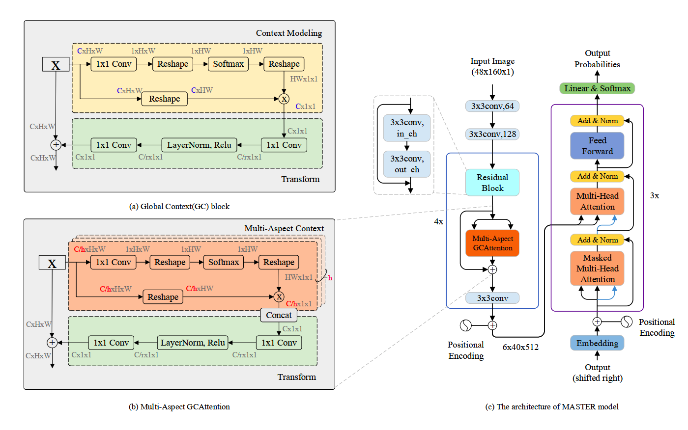
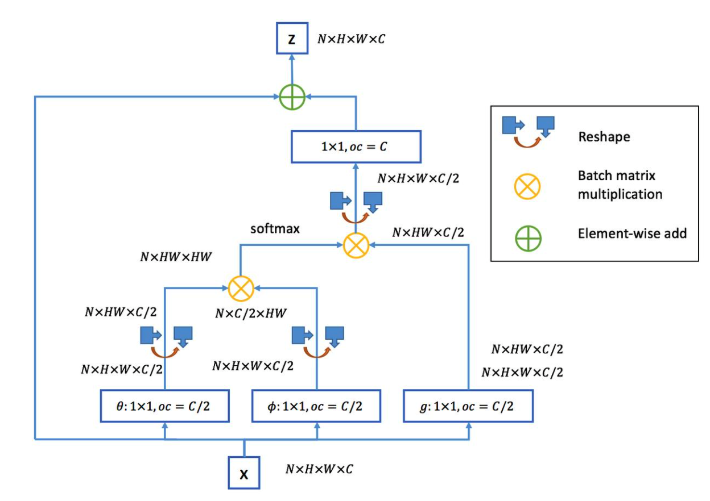

# MASTER(Multi-Aspect Non-local Network for Scene Text Recognition)

* Insight
  * 基于RNN的encode-decode文字识别结构，由于编码特征高度的相似性，导致注意力偏移的现象，
  * RNN-based model并行性（训练）较差
  * 采用transformer的解码结构，提高训练的并行性，同时由于transformer更强的编码能力，进一步缓解attention drift问题
* CNN编码输入图像，得到二维的图像特征表达，6x40x512，reshape成 240 x 512的序列，使用transformer解码获取文字
* 模型结构
  
* 主要创新
  * 针对attention-drift以及模型并行化的问题，引入了transformer模块
  * 引入了global context模块,类似于non-local block模块，仿照transformer的multi-head形成了multi-aspect gc模块
    * Non-Local Block
      
    * multi-aspect gc block
      
    * gc block是non-local block的简化版，前者用一个1x1的卷积沿着channel将feature map降到一维，计算注意力权重，
      后者利用两个1x1的卷积计算注意力权重。
    * 可以看出gc block计算的是二维空间的 注意力权重
    * 输入160x48，编码后是40x6 序列长度是240
  * Decoder
    * transformer的解码与lstm的解码类似，用encoder部分的输出计算注意力权重，并对输入向量重新分配，获得当前时刻的输入
    * 从模型结构示意图可以看出，在解码阶段
      * 首先用multi-head attention计算当前时刻的输入编码，得到tmp_feature,相当于LSTM中将时刻t-1的输出输入到模型中
      * 随后获取encoder部分的输出，分别作为Key和quary,计算获得注意力权重，并利用该权重对tmp_feature（value）重新分配
      * 为了降低计算量，本篇文章使用了memery-cache的手段，存储$K_t=x_tW_K$​​与$V_t=x_tW_v$​​​ ，由于解码阶段依旧是step-by-step的计算方式，每个时刻需要计算$(XW_k)(XW_q)^T(XW_v)$​，因此，使用memery-cache手段，存储每个时刻计算的结果，可加快推理速度。
      * t=1,KQV = [$x_{t0}W_K$] [$y_{t0}Wq$​] [$x_{t0}W_V$]
      * t=1,KQV = [$x_{t0}W_K;x_{t1}W_K$​] [$y_{t1}Wq$​] [$x_{t0}W_V;x_{t1}W_V$​​]
      * ...
      * 从上面的地推计算公式可以看出，每个时刻计算需要用到历史的计算结果，此时将历史的计算结果存储在内存中，就可以降低计算速度
      * 解码时，当前时刻的结果，是前面t-1个时刻attention后重新分配得到的，我们把每个时刻计算
  * 问题：中文字符识别需要采用特殊手段降低one-hot编码带来的显存占用问题。
  * 
  * Q1:  怎么理解【output embedding】?
    * 训练阶段， output embedding就是target sequence embedding之后的结果，和encode部分的feature，计算注意力权重，并获得当前状态的feature；推理阶段，output embedding是预测出来结果的embedding
  * Q2：推理加速？
    * 每个时刻的输出结果都是前$t-1$时刻，都是特征加权平均再分配的结果，由于$W_k,W_v,W_q$固定，$X_t$固定，那么对于历史时刻的
  * Q3： s2s任务的流程，transformer encode部分编码输入序列，获得特征$X$；
    * 训练阶段：【decode】部分的输入是target sequence词嵌入，用transformer编码，得到target sequence编码后的向量表示，作为【Query】。同时【Encode】部分的$X$分别作为【Key】和【Value】。其中，【Key】和【Query】计算得到【Attention】权重，作用在【Value】上，得到当前时刻的隐向量，需要注意的是，这里会引入下三角矩阵，防止信息泄露。
    * 推理阶段：【decode】部分的输入，是前一个时刻预测的结果，随后会经word embedding、transformer，作为【Query】与【encode】部分的【Key】计算【Attention】权重。
  * Q4: 如何理解【memery-cache】?
    * memery-cache是transformer在解码阶段加速的手段，保存计算attention所需要的结果:$k_t,v_t,q_t$ ，其中：
      * $k_i=W_k*x_t;K=[k_1;k_2;....;k_t]$
      * $q_i=W_q*x_t;Q=[q_1;q_2;....;q_t]$
      * $v_i=W_v*x_t;V=[v_1;v_2;....;v_t]$
      * $att = softmax(KQ)$