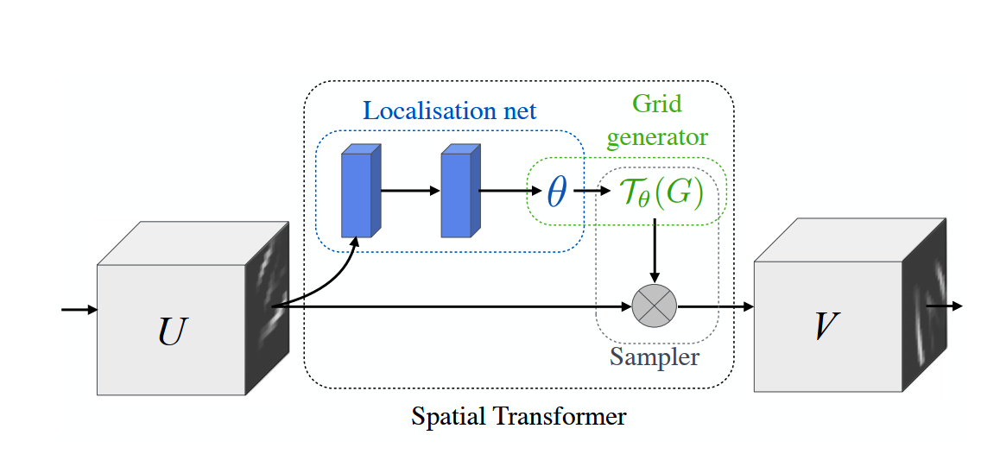

# RARE(Robust scene recognition with Automatic REctification)

* 目的：解决不规则文本的识别问题
* 模型
    * [STN [Spatial Transformer Network]](https://zhuanlan.zhihu.com/p/41738716)
      
        
      * 叙述
        * 学习输入图片的仿射变换矩阵
        * 将变换矩阵作用在预先设定的基准坐标上，获取基准坐标在输入图片上的位置，由于位置可能是非整数，采用双线性插值解决
        * 将基准坐标变换到原始图像上，再利用双线性插值得到变换后的值
        * 对source coordinate做双线性插值得到仿射变换后结果
          
      * Localization Network
        * 回归K对样条变换点
          
      * Grid Generator
        * 利用样条变换点估计变换参数（可逆），并获取输出feature map与输入feature map的映射关系
          
      * Sampler
        * 计算输出feature map每个像素点的值
            
        * 点p'【变换后的点】由点p【变换前的点】线性插值得到,注意，该线性插值方法属于后向插值的一种，即给定输出feature map上的一点，
          需要反向变换找到其在输入feature map上的对应的位置， 假如对应到输入的位置是浮点数，需要用线性插值的方法计算该浮点位置的值
      * 注意
        * 我们利用变换矩阵，反向求每个位置feature map的值在原始输入上的位置（从【0，0】开始，到【N,M】结束），原始位置可能是非整数，
          线性插值计算，（双线性插值是可导函数，满足反向传播的需求）
        * 例如，变换后的点A位置为（1,2）【Localization Network】，对应到变换前的点B的位置为（0.8,1.5）【Grid Generator估计变换矩阵，
          得到变换前的位置】,此时对B做双线性插值【Sampler】，得到B点的值，即A点的值
          * 假如存在N个关键点，那么变换矩阵T初始化为[N+3，N+3]
          * 计算变换矩阵的逆，并作用在target_points上，得到target_points在source points对应的位置，并利用双线性插值的方法计算target_points
          * 以仿射变换为例，通过三个点，我们可以求得仿射变换矩阵，然后将仿射变换矩阵作用在变换后的目标位置上，得到变换前的位置，
            而此时得到的变换前的位置可能是非整数位置A，则需要用到双线性插值的办法计算位置A的值。
             
      * 可导性
        * 输出特征V对输入特征U的可导性
        * 输出特征V对source coordinate的可导性（优化localization network）
        * source coordinate对输入特征U的可导性 （显而易见）
        
    * SRN(Sequence Recognition Network)
        * attention-based model
        