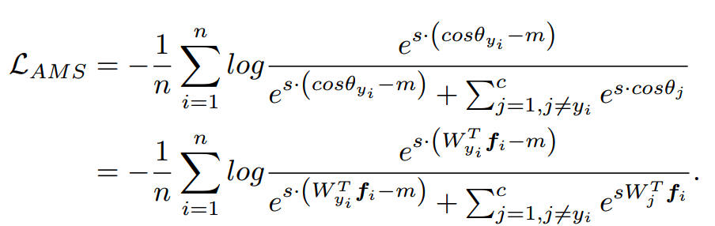
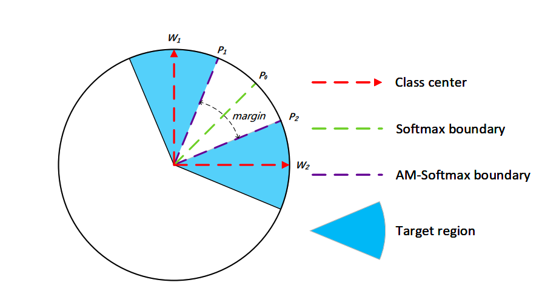

# AmSoftmax

* 主要创新点
  * 将角度边界（更加简洁的角度边界【原始为cos(theta-m)】，梯度求解更加的方便）引入了softmax函数，增加类间距，减少类内距。
* 损失函数如下：
  
  * AmSoftmax与softmax函数相比，将 Wx 替换为 s*(cos(theta)-m)
  * cos(theta) - m 表示类别间至少有m的距离
  * 将分子exp项归一化，可以看出损失函数值相较softmax的形式会增加，模型需要提高cos(theta)值
    才能达到变化前的值。
  * 从softmax的角度来理解，对于某个类别，softmax+cross entropy会增加当前类别的权重降低其他类别的权重，同样的，AmSoftmax也会增加分子权重
  * 角度距离大于m，分子的幂大于0,正向作用（降低loss），反之,对降低loss是反向作用
  * s增加收敛速度
* 共性
  * 引入可学习参数，视作是类别中心，引入余弦距离的概念，最小化类别中心向量与target的距离
* 看本质
  * 
  * 蓝色扇形为一类样本所在的区域，$W_1$和$W_2$分别表示两个类别的一个样本，引入决策边界距离的margin,会有 $W_1P_1-m=W_2P_2$，增大m即增大类间距，类内距会相应地减少
  * 将$softmax$中的$W$和$X$归一化【余弦距离度量】，并且引入margin，最大化决策边界【拥有margin的情况，w和x的角度要更小才能与没有margin的情况相等】