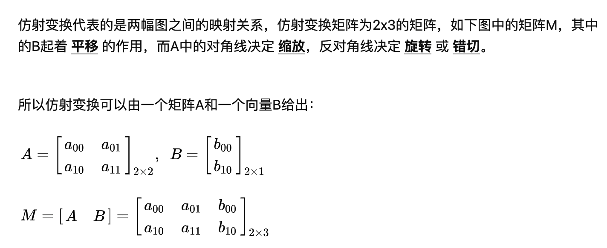

# 图像数据增强

### 反色

```python
class Invert:
    def __init__(self, p):
        self.p = p

    def __call__(self, data: dict) -> dict:
        if random.random() > self.p:
            return data
        im = data['img']
        _, _, c = im.shape
        im[:, :, :] = 255 - im[:, :, :]
        data['img'] = im
        return data
```

### 水平翻转

```python
class HorizontalFlip:
    def __init__(self, p):
        self.p = p

    def __call__(self, data: dict) -> dict:
        if random.random() > self.p:
            return data
        im = data['img']
        text_polys = data['text_polys']

        flip_text_polys = text_polys.copy()
        flip_im = cv2.flip(im, 1)
        h, w, _ = flip_im.shape
        flip_text_polys[:, :, 0] = w - flip_text_polys[:, :, 0]

        data['img'] = flip_im
        data['text_polys'] = flip_text_polys
        return data
```

### 垂直翻转

````python
class VerticalFlip:
    def __init__(self, p):
        self.p = p

    def __call__(self, data: dict) -> dict:
        if random.random() > self.p:
            return data
        im = data['img']
        text_polys = data['text_polys']

        flip_text_polys = text_polys.copy()
        flip_im = cv2.flip(im, 0)
        h, w, _ = flip_im.shape
        flip_text_polys[:, :, 1] = h - flip_text_polys[:, :, 1]
        data['img'] = flip_im
        data['text_polys'] = flip_text_polys
        return data
````

### 随机噪声

```python
class GausianNoise:
    def __init__(self, p, mean=0, var=0.1):
        self.p = p
        self.mean = mean
        self.var = var

    def __call__(self, data: dict) -> dict:
        if random.random() < self.p:
            image = data['img']
            noise = np.random.normal(self.mean, self.var ** 0.5, image.shape)
            out = image + 0.5 * noise
            out = np.clip(out, 0, 255)
            out = np.uint8(out)
            data['img'] = out
        return data
```

### 随机模糊

```python
class GaussianBlur:
    def __init__(self, p):
        self.p = p

    def __call__(self, data: dict) -> dict:
        h, w, _ = data['img'].shape
        if h > 10 and w > 10 and random.random() < self.p:
            img = cv2.GaussianBlur(data['img'], (5, 5), 1)
            data['img'] = img
        return data
```

### 颜色变换

* 饱和度 （颜色深浅）
* 色调
* 明度（图片的明暗程度）

```python
class AugmentHSV:
    def __init__(self, p, hgain=0.5, sgain=0.5, vgain=0.5):
        self.p = p
        self.hgain = hgain
        self.sgain = sgain
        self.vgain = vgain

    def __call__(self, data: dict) -> dict:
        if random.random() > self.p:
            return data
        img = data['img']
        r = np.random.uniform(-1, 1, 3) * [self.hgain, self.sgain, self.vgain] + 1  # random gains
        hue, sat, val = cv2.split(cv2.cvtColor(img, cv2.COLOR_BGR2HSV))
        dtype = img.dtype  # uint8

        x = np.arange(0, 256, dtype=r.dtype)
        lut_hue = ((x * r[0]) % 180).astype(dtype)
        lut_sat = np.clip(x * r[1], 0, 255).astype(dtype)
        lut_val = np.clip(x * r[2], 0, 255).astype(dtype)

        img_hsv = cv2.merge((cv2.LUT(hue, lut_hue), cv2.LUT(sat, lut_sat), cv2.LUT(val, lut_val)))
        img_hsv = cv2.cvtColor(img_hsv, cv2.COLOR_HSV2BGR)
        data['img'] = img_hsv
        return data
```

### 马赛克增强

* 利用四张图拼接成一张大图，随即缩放到指定尺寸，该方法可以有效地增加检测目标的个数，同时可以增加小目标的个数，对小目标的拟合比较友好。
* 具体实现见 [马赛克增强](script/mosaic.md)

### 随机裁剪

* 非目标检测任务中设置随机裁剪的范围，进行随机裁剪，而目标检测任务的随机裁剪需要根据box的位置进行裁剪，具体实现见[随机裁剪](script/crop.md)

### 仿射变换

* 仿射变换包括旋转、平移、缩放，可用如下矩阵实现：
  

* 透视变换是二维坐标到三维坐标的变换，是非线性变换，需要四个坐标点求得变换矩阵

