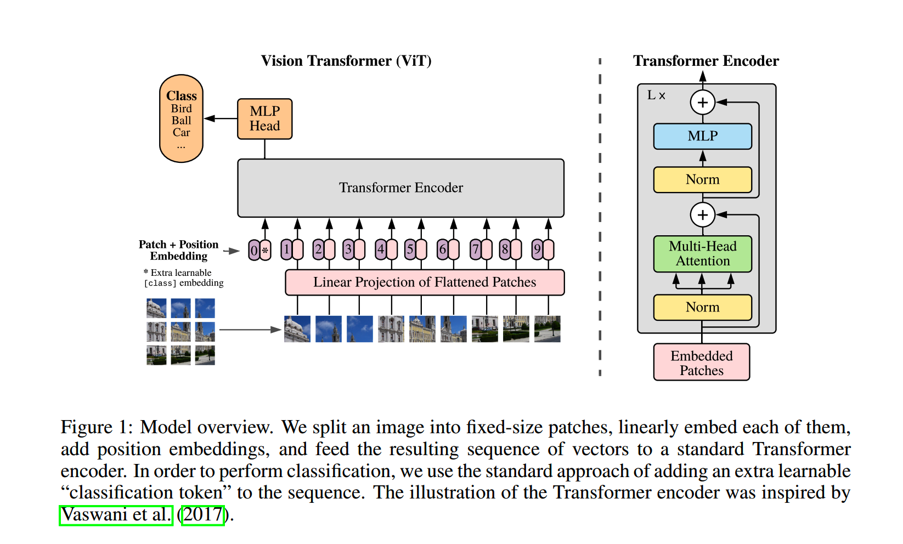
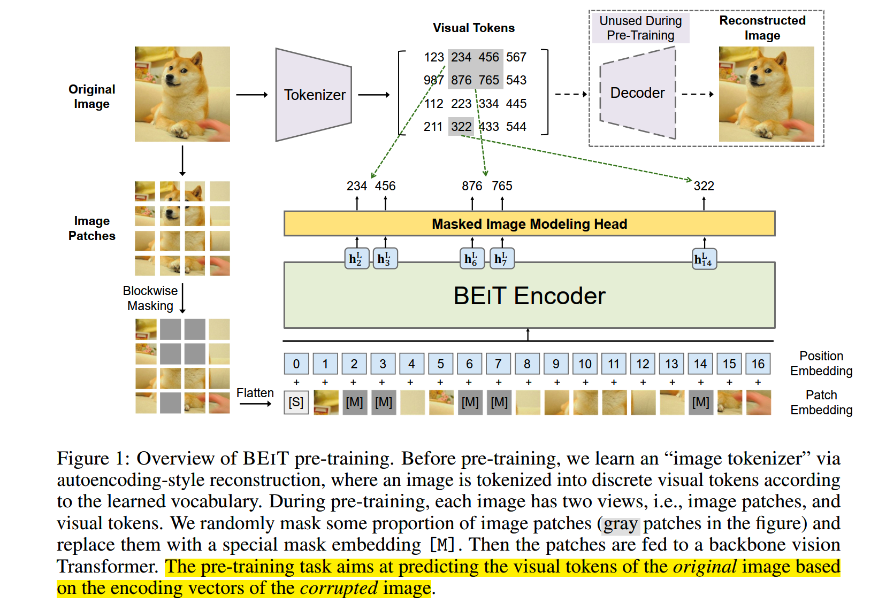
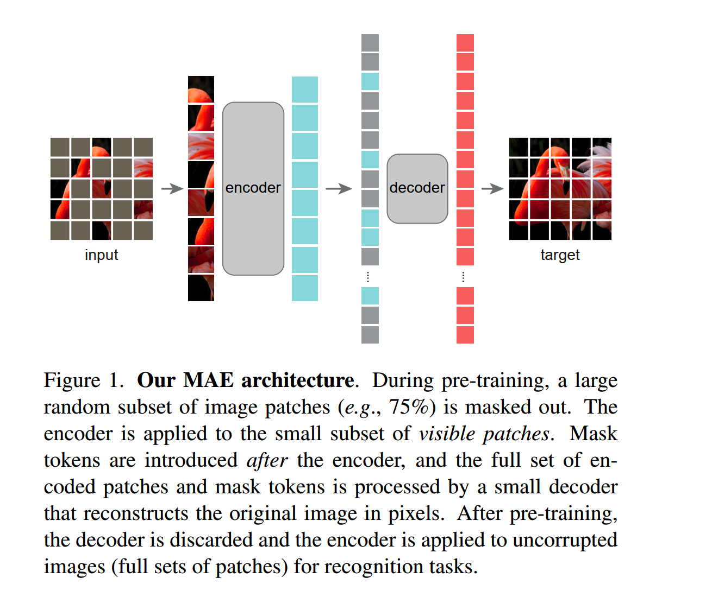

# DETR

* Detection  transformer
* 预测目标的集合【没有NMS的概念】，匈牙利算法，实现 prediction与target的最大匹配,这里可以通过类似于IoU的值，确定正负样本
* 没有anchor的概念，取而代之的是 object query，【object query在机器翻译中类似于target sequence的概念】，这里是随机初始化,是一个可学习的参数
* Spatial position embedding

# ViT

* 将图像划分成若干个patch, 得到$[N,P*P*C]$的向量表示，$P*P*C$相当于word embedding，为了保留位置信息，引入了可学习的位置向量，二者作为transformer的输入，进行模型预训练。
* 直接在300M图像上做的分 x

# BEiT

* dVAE把每张256x256的RGB图片压缩成32x32的图片token，每个位置有8192种可能的取值(也就是说dVAE的encoder输出是维度为32x32x8192的logits，然后通过logits索引codebook的特征进行组合，codebook的embedding是可学习的)。
* dVAE将patch离散化，并mask掉部分patch，
* 在预训练目标：
  * 预测被mask掉的值
  * 用deocde还原图像

# MAE

