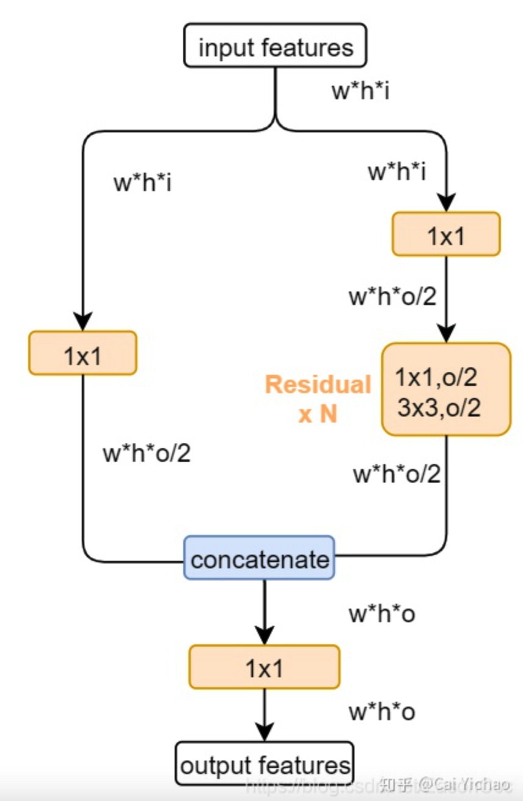

# YOLOX

### thinking

* 正负样本的选择
  * label assignment
  * loss
* 不同设备的实时性
  * 参数量不同的模型
  * Anchor-free
  * CSPDarknet

### trick

* ✨simOTA（label assignment）
  * 一种基于先验信息的正负样本选择方法
  * 论文中计算分类与回归的loss，选择标签中心固定区域的topk个正样本（并对应到固定的grid区域），其余的grid区域是负样本
* ✨Anchor-free
  * Anchor-base方法需要聚类分析，聚类得到的anchor是特定数据集下的anchor,泛化性不强
  * Anchor-base方法从一定程度上会增加detection head的计算量
  * Anchor依赖于数据集，泛化性不强
  * 会增加detection heads的复杂度
  * 相比
* ✨Decouple-head
  * yolo的解耦头表达能力有欠缺，所以采用了decoupled-head，但这种方式会带来额外的计算，因此会先用1x1的卷积对数据先降维，然后再连接两个3x3的卷积。
* ✨Augmentation
  * mixup
  * Moscia
  * 重要的是，在结束前15个epoch处停止上述两种数据增强，因为这种数据增强已经偏离了真实的自然图片分布

* 总结

  * 值得注意的是，这里提出了yolo系列里很少涉及的label assignment策略，这是一种基于先验信息的样本选择方法

* 正负样本的选择方法

  * yolov3的后续实现版本中，一个gt可能对应多个anchor，为了增加正样本的数目，只要iou达到阈值，就认为是正样本，用于回归分类，那么yolov3中如何选取负样本呢？

    * yolov3中正样本用于回归和分类任务，负样本用于分类任务

    * respond_bgd = (1.0 - respond_bbox) * tf.cast(max_iou < self.iou_loss_thresh, tf.float32)

    * respond_bgd * tf.nn.sigmoid_cross_entropy_with_logits(labels=respond_bbox, logits=conv_raw_conf)

    * 从上面我们可以看出用于分类的负样本是 IoU小于一定阈值的样本

      

  CSPDarkNet结构图[Cross Stage Partial Network]

  

可以看出，input feature并非直接split成两个特征，而是借用1x1的卷积降维得到，降维后再经历类似resnet的操作，最后利用concat合并特征

cspnet的优势：速度快