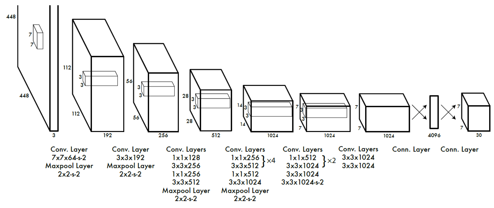
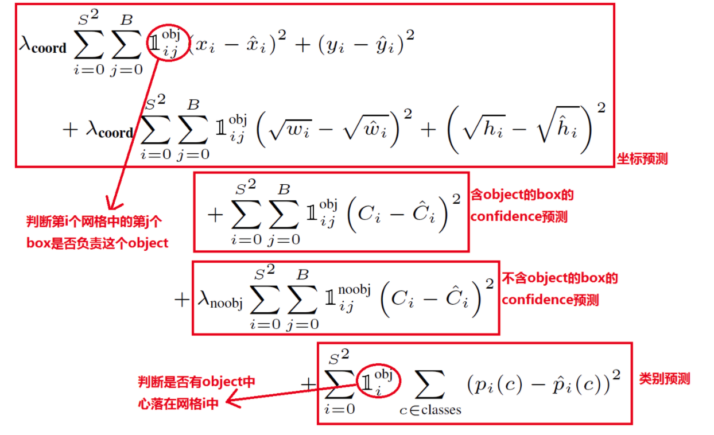

# YOLO-v1

* 论文链接: https://arxiv.org/abs/1506.02640

## 模型结构

* vgg+fc+conv
* 两层fc层，分别降维到4096和1470
* 存在全连接层，只能输入固定尺寸的图片
* 输出是 S * S * ( (4+1) * B + C)  ; B=2，表示每个位置预测两个box；C=20，表示20分类；1表示box的置信度；4表示坐标框的位置
* 正负样本是怎么选取的？
  * 与目标框有重叠的区域视为正样本，其余区域视作负样本，密集型场景，一个网格点可以包含多个目标，此时选择IoU最大的，因此无法处理密集型小目标的场景。

## 损失函数

* 损失函数包含三个部分：坐标损失，目标二分类损失，目标多分类损失

* 坐标损失，对宽和高分别开平方根，目的是缓解大目标和小目标之间的差异，希望让小目标对偏移量更敏感些，让大目标更缓和些，但不能解决问题。【可以从平方根梯度的角度理解】，目前采用IoU loss解决这种问题。

* 多分类，只有当某个网格中有目标时，才对分类损失进行惩罚

* 二分类，所有的单元格的box都需要参与二分类计算。

* 坐标回归，回归的是坐标的偏移量以及长宽的偏移量，每个位置回归两个box，这里不是通过anchor的方法获得，单纯的通过中心点以及宽高表示，

  