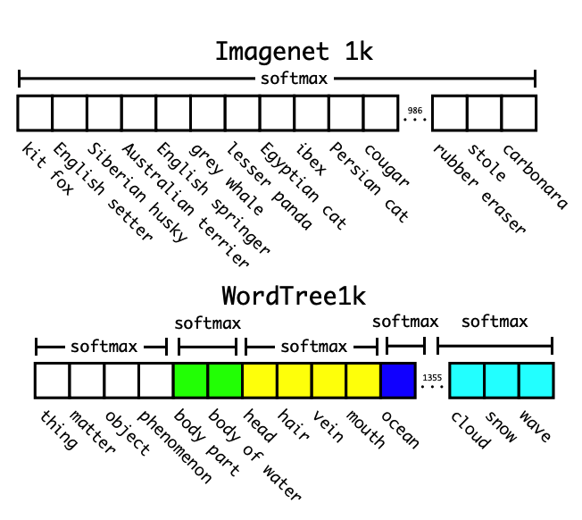

# YOLO-v2

### 改进之处

* 采用更大尺寸的图片输入
* 参考faster rcnn中的RPN网络，提出anchor box
* 删除了全连接层，进行尺度训练
* 将预测边框的中心限定在一定范围内，增加模型拟合的稳定性
* 分层分类:
* 将标签划分为分层树结构，根节点是子节点的父类，某个节点的概率等于该节点到根节点所有条件概率的乘积，分层结构的softmax是在同一下位词的同义词集里面计算softmax，预测时，每次选择当前层级得分最高的节点，直到已选择节点的乘积小于某个阈值时停止。训练时，如果标签是人，那么只对“人”这个节点及其所有的父节点进行loss计算。
* 