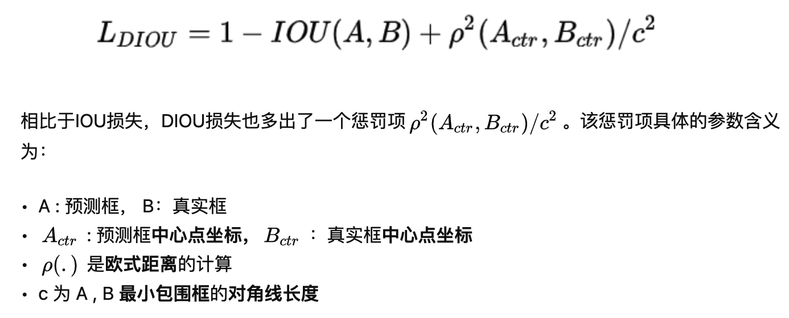

# YOLO-v5

#### input
* AutoAnchor：每次新建训练任务，会根据当前的训练数据，重新计算anchor
* 自适应图片缩放：按照输入图片的比例缩放到指定尺寸，不足的地方用纯色（114）补充

#### backone
* CSP结构

  * 作者认为网络计算量大是因为网络在优化过程中存在重复的梯度信息，将base layer一分为二，并在尾部进行特征融合，降低计算量

* Focus结构，对输入图片进行切片，切片后的数据叠加得到新的输入数据，切片规则：在行列上每隔N个像素进行一次采样，将采样后的结果进行拼接得到一张 (W/N,H/N,3)的图片。
  * ` The main purpose of the Focus layer is to reduce layers, reduce parameters, reduce FLOPS, reduce CUDA memory, increase forward and backward speed while minimally impacting mAP.`
    
     * FLOPs衡量模型的复杂度
    ```python
    import torch.nn as nn
    from models.common import Focus, Conv, Bottleneck
    from utils.torch_utils import profile 
    # c1, c2, k=1, s=1
    m1 = Focus(3, 64, 3)  # YOLOv5 single layer
    m2 = nn.Sequential(Conv(c1=3, c2=32, k=3, s=1), Conv(32, 64, 3, 2), Bottleneck(64, 64))  # YOLOv3 equivalent layers
    #  Bottleneck :  shorcut模块
    profile(x=torch.randn(16, 3, 640, 640), ops=[m1, m2], n=100)  # profile both 100 times at batch-size 16
    ```
    ```text
    1.8.1+cu101 cuda _CudaDeviceProperties(name='Tesla V100-SXM2-16GB', major=7, minor=0, total_memory=16160MB, multi_processor_count=80)
    
      Params      GFLOPS    forward (ms)   backward (ms)                   input                  output
        7040       23.07           4.958           12.76       (16, 3, 640, 640)      (16, 64, 320, 320)  # Focus()
       40160       140.7           26.15             125       (16, 3, 640, 640)      (16, 64, 320, 320)  # YOLOv3 layers
    
    ```

* CBM结构，M为Mish，是一种更加平滑的激活函数【无上界，有下界，拥有较小的负梯度，保证信息的流通】

#### neck
* FPN 
  * 特征上采样，得到的结果与浅层同尺寸大小的feature进行融合
* PAN 
  * 特征上采样之后，再进行下采样，在FPN的基础上再进行一次反向操作，深层特征下采样，与浅层同尺寸的特征进行融合。
* SPP 
  * Spatial Pyramid Pooling(空间金字塔池化),用多个不同尺寸的核，对特征进行池化，并将池化后的后果进行拼接，得到固定长度的特征表达，用于后续的分类（优势：降低目标大小对分类的影响）
  * 在实际的工程中，针对不同大小的kernel，采用不同的padding长度，使得多个kernel输出feature尺寸一致，方便后续直接叠加。

#### loss

* smooth l1 loss
	* 自变量在0附近为二次函数，远离0是一次函数，好处是：训练初期，loss较大，可以提高模型拟合的稳定性，训练后期，损失值很小，梯度也会减小（在不调节学习率的情况下，相比于一次函数），可防止模型在局部震荡。
* IoU loss
  * 解决了训练过程与预测过程度量指标不一致的问题（原先采用目标boxe的偏移作为回归目标，预测过程采用目标重叠面积的交并比作为评价指标）
* GIoU loss
  * 解决了IoU loss在目标框与预测框没有重叠面积时，梯度为0的情况
  * 引入了最小外包围面积的概念，通过计算两个box在最小外包围面积中的占比来表述损失
* DIoU loss
  * 在IoU loss的基础上引入一个简单的惩罚项，用于最小化两个检测框中心点的标准距离，便于加速收敛。
  * 为了加速收敛，引入了中心距离的损失项
  * 两个box的中心距离+最小外包围矩形的对角线距离做归一化
  * 
* CIoU loss
  * 引入了box长宽比的概念，希望预测目标的长宽比例更倾向于标注目标。
    * 计算时需要用到标注框的宽与高，因此在推理的过程中无法使用CIoU NMS，转而使用DIoU NMS。
* 正负样本的选择
  * IoU作为分类的target

#### NMS

* DIoU NMS
	* IoU-x,小于阈值则保留，大于阈值则过滤；x表示box的中心距与最小外包围对角线距离的比值 【x越小，两个box越贴合，相似度越高，x可理解为两个box的相对中心距】
	*  x越大（beta越小），越容易保留更多的目标框，通过调节beta值，可缓解遮挡物体的检测效果。
	
#### 数据增强

* mosaic
	* 随机筛选四张图进行拼接 
* MixUp
  * 两张图片以一定的比例进行图片叠加，标签按数量增加
* CutMix
    * 把一张图抠出来，粘到另外一张图上去
