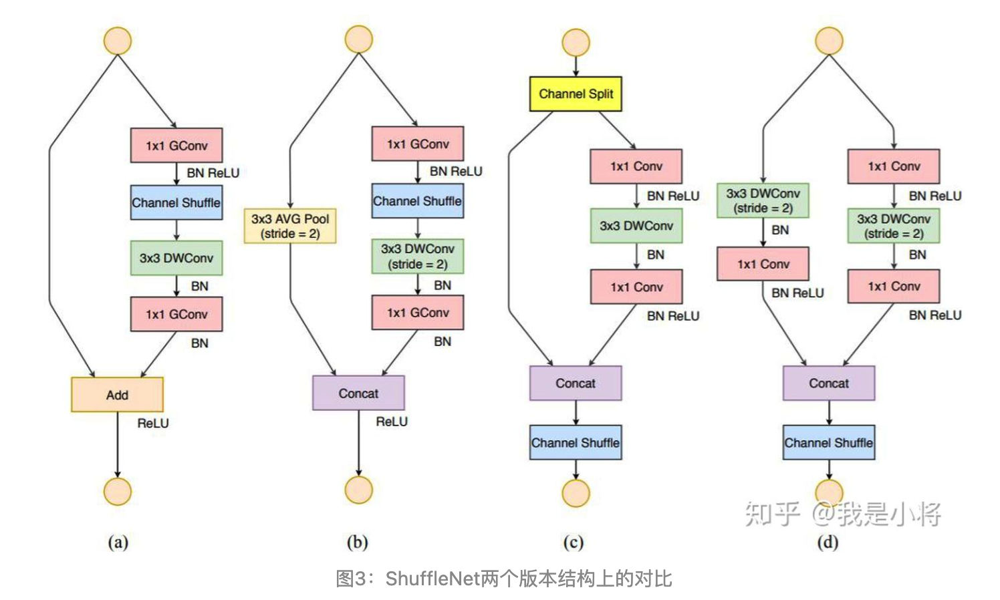

# ShuffleNet_v2

* 衡量模型复杂度的一个通用指标是FLOPs（multipy-add的数量），但这并不完全等同于速度，还会受其他因素影响，比如：内存使用量（MAC），并行速度，不同平台。
* 降低内存使用量
  * 输入通道与输出通道数目相同最小化内存使用量
    * 1x1的卷积平衡输入与输出通道大小
  * 过量使用group convolution会增加MAC
    * 注意分组数目
  * add操作会增加MAC
* 网络并行化
  * 网络碎片化会降低并行度：类似Inception中多路结构，会降低模型的并行度
* Shufflenet_v2的改进：
  * Shufflenet_v1提出group convolution+channel shuffle替代传统卷积，与之对标的mobilenet_v3中的depthwise convolution与pointwise convotion
  * Depthwise convoltion相当于group=n的分组卷积，考虑到分组数目不宜过多，因此该算子可能不是一个明智的选择。
  * 为了解决v1的存在的缺陷，v2引入了一个新的算子：channel split，将输入分成两个通道数相同的特征，左边做indentity map，右边做三个连续的卷积，并且输入通道与输出通道相同【1x1 Conv + 3x3 DWConv + 1x1 Conv】（这里的变化是1x1 GConv编程了1x1 Conv）,除此之外shortcut的输出端，放弃了add操作采用了concat操作，为了增加信息的交互，对concat的结果进行channel shuffle的操作
* 

