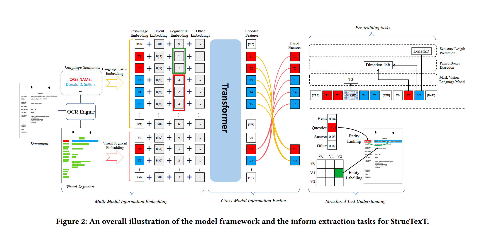

# StrucTexT

Structured text understanding on Visually Rich Documents (VRDs) is a crucial part of Document Intelligence. Due to the complexity
of content and layout in VRDs, structured text understanding has been a challenging task. Most existing studies decoupled this problem into two sub-tasks: entity labeling and entity linking, which require an entire understanding of the context of documents at
both token and segment levels. However, little work has been concerned with the solutions that efficiently extract the structured
data from different levels. This paper proposes a unified framework named StrucTexT, which is flexible and effective for handling both
sub-tasks. Specifically, based on the transformer, we introduce a segment-token aligned encoder to deal with the entity labeling
and entity linking tasks at different levels of granularity. Moreover, we design a novel pre-training strategy with three self-supervised
tasks to learn a richer representation. StrucTexT uses the existing Masked Visual Language Modeling task and the new Sentence Length Prediction and Paired Boxes Direction tasks to incorporate the multi-modal information across text, image, and layout. We evaluate our method for structured text understanding at segment-level and token-level and show it outperforms the state-of-the-art counterparts with significantly superior performance on the FUNSD,SROIE, and EPHOIE datasets

* Layout embedding
  * $L = Emb_𝑙 (𝑥0,𝑦0, 𝑥1,𝑦1,𝑤, ℎ)$
  * 对于没有字符级别或者单词级别标注的，采用segment-level级别标注结果估计单词或字符位置
* Language token embedding
  * language token embedding
    * $T = Emb𝑡 (S) + L$ 
    * $S = {[CLS], 𝑐_1^1, · · · , 𝑐_{𝑙_1}^1, · · · , 𝑐_1^n, · · · , 𝑐_{𝑙_𝑛}^𝑛, [SEP]} $
* Visual segment emebedding
  * $V = Emb_𝑣 (ROIAlign(CNN(𝐼), 𝑏)) + L$
* Segment ID embedding:  
  * 每个text segment 分配唯一一个id
* other embedding
  * position embedding
    * encodes the indexes from 1 to maximum sequence length
  * Segment embedding
    * denotes the modality for each feature

* 预训练任务

  * Masked Visual language model
    * 两个输入源：图像与文本，按一定的比例mask文本中部分token，并预测被mask的token，对应的图像区域不做mask,目的是建立图像与文本之间的关联
  * 字符长度预测
    * 对图像segment（RoI）预测该区域的单词长度

  * 字段方位预测
    * 预测两个segment的方向关系【8种】
    * 根据两个segment的相对位置关系，确定具体方向

