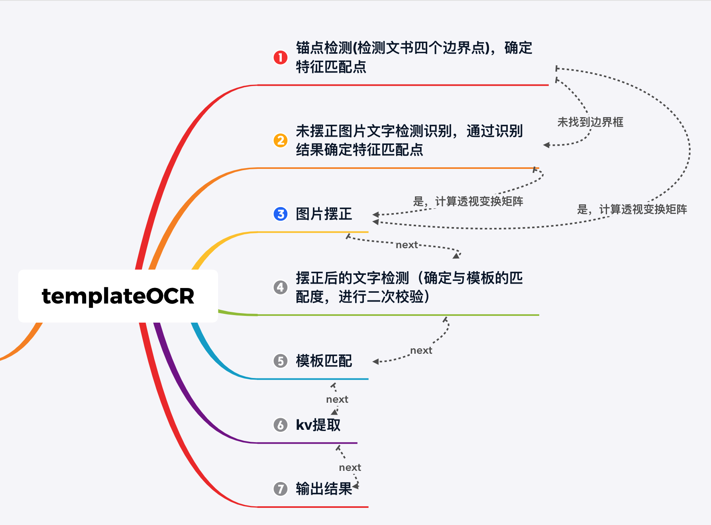

# 文书版面分析

* 目的：提取200+种文书的关键字段提取【申请书，决议书，处决书，拘传证】
* 困难：文书的种类多，同种类型的文书在不同的省市呈现的样式各不相同，待提取的字段范围广泛

* 整体流程图

  

* 采用的方案：
  * templateOCR
    * templateOCR目的是抽取文书中指定键值对信息，包括但不限于【犯罪嫌疑人，姓名，性别等】
    * 整个过程，确定合适的锚点，将会带来稳定的识别结果
  * 锚点确定
    * 1、目标检测：文书边框检测，检测目标定义为边界框的四个顶点，这一步将解决90%以上的锚点定位问题
    * 2、文字特征匹配：为了应对第一步，锚点定位错误的情况。这里增加了一个备用方案，通过文字识别结果，进行特征字符匹配，进而确定锚点，确定不了锚点的，认为是非目标样本，直接丢弃。
    * 3、步骤1和步骤2，都能给我们提供相匹配的锚点对，利用这些锚点对，我们可以计算得到对应的透视变换矩阵，并对图像进行透视变换【透视变换是为了摆正扭曲或者倾斜的图像】
    * 4、对摆正后的图像进行文字检测识别，并计算新的透视变换矩阵，确定和模板的匹配度
    * 5、确定是否与模板匹配，不匹配则丢弃
    * 6、假如与模板匹配，则确定指定区域的字段即可，这里考虑到【相同类别不同地域】文书的排版方式各有差异，为了能更加灵活地定位指定区域，我们额外增加了【关键区域检测模块】, 该模块可以动态地确定关键字段信息所在的位置【同时解决相同字段跨行的问题】，最后通过【文字检测区域】与【关键字段区域】的交集确定key-value。
    * 根据指定需求字段，结合相应的后处理，输出指定结果。

----------

templateOCR主要包含如下几个模块：

* 图片方向分类模块：纠正图片的视觉角度，可分为0，90，180，270
* 文书角点检测模块：用于检测文书的边界点，摆正文书图片，主要用于摆正有一定拍摄角度的图片
* 文字检测模块：检测图片文本行
* 文字识别模块：识别检测到的文本行
* 后处理模块：纠正错误识别的结果以及校验识别结果
* Pipeline:
  * 文书方向分类，对任意角度拍摄的图片进行方向分类，并根据分类结果对图片做旋转，为后续文字识别以及摆正图片【计算仿射变换矩阵】做铺垫工作。
  * 角点检测，检测文书的边框【为什么检测黑框？仿射变换更加稳定，计算仿射变换矩阵的几组点所围成的面积会非常大，避免文文本框检测波动带来的不利影响】
  * 全文ocr
  * 根据全文ocr的结果判断文书类型，这里主要是正则匹配
  * 根据类型加载预定的模板信息
  * 结合角点检测结果，摆正文书，当然这里会存在角点检测异常的情况，假设检测两个以及两个以下的角点，或者四个以上的角点，这时候认为角点检测异常，则利用预先定义的参考框 确定用于摆正图片的参考点，这里尽可能的选择较为分散的参考点用于计算仿射变换矩阵
  * 利用仿射变换矩阵，对坐标做仿射变换，这里没有对原始图片做仿射变换，原因是我们一开始为了确定文书类型，已经做了全文ocr了，这里就不需要在对图片做仿射变换，进行全文ocr了。
  * 加载预先定义的感兴趣区域，并对ocr检测框进行阶段，并重新识别截断后的文字区域，得到【】。
  * 经过上述步骤，我们可以得到所有预定字段的信息，考虑到文书的多样性，同种文书的会有不同的排版方式，上述的字段抽取方式会出现非常严重的偏移问题，甚至是乱码，为了应对这种问题，我们进行了字段校验，校验失败的情况，则认为当前模板匹配失败
  * 为了应对不在数据库中的模板信息抽取问题，我们采用了正则方法，做了一套兜底方案，但是这种正则匹配的问题无法解决 一条横线上的两行地址抽取问题，主要是因为文字检测结果排版不当导致的，也正是这个原因，我们建模角点检测，关键点检测模块。
  * 

