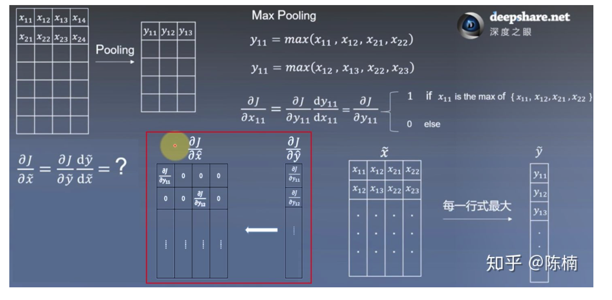

# 基础知识

[TOC]

## CNN相关

* depthwise separable conv?
    * depthwise conv?
        * 一个卷积核只负责一个通道，得到一个通道的结果，而传统卷积是N个卷积核负责N个通道，得到一个通道的结果
    * pointwise conv?
        * 1x1的卷积，depthwise conv无法实现特征的升维与降维，控制模型参数
* 卷积的复杂度和卷积的参数量
    * 传统卷积
        * 复杂度（FLOPs）
            * 卷积一次的计算量
                * 乘法计算量：$ C_{in} * K * K$
                * 加法计算量：$ (C_{in}-1) * K * K + 1$(忽略)
            * 总的计算量（不考虑加法）：$ (C_{in} * K * K) * W * H * C_{out}$​
        * 参数量
            * $K * K * C_{in} * C_{out}$​
    * depthwise separable conv
        * depthwise conv
            * 卷积一次的计算量
                * 乘法计算量：1 * K * K
                * 加法计算量：无
            * 总计算量（不考虑加法）： $K * K * W * H * C_{out}$
        * pointwise conv
            * 卷积一次的计算量
                * 乘法计算量：$C_{in}$
                * 加法计算量：$C_{in}-1$
            * 总计算量（不考虑加法）： $C_{in}*W*H*C_{out}$
        * 总计算量：$K * K * W * H * C_{out} + C_{in} * W * H * C_{out}$​​
        * 深度可分离卷积计算量是传统卷积计算量的：$1/C_{in} + 1/K**2$​​
    * deformable conv
        * 传统发的卷积计算方法拥有固定的几何结构，对几何形变的物体建模受限，而dfc通过学习额外的偏移量，使得卷积核在 input feature
          map的采样点上发生偏移，实现在当前位置周围随意采样，由于位置的随意性，会出现非整数点的情况， 而这种情况的值，需要通过双线性插值的方法实现。
    * group conv
        * 降低卷积计算的浮点运算量
* 如何理解参数共享？
    * 表面意思：对于input feature map,output feature map的每一个像素点都是由相同权重与input feature map在卷积的操作下得到的
    * 减少参数量
    * 构建局部特征？
* 感受野计算
    * $RF_i = (RF_{i-1}-1)*s+k$
* 卷积的矩阵运算
    * img2col:从左到右，从上到下，取一个kernel范围内的特征，拉平，放置在一行（多通道，水平方向concat）
    * kernel拉平，放置成一列(多通道，垂直方向concat)
    * 矩阵相乘得到相应位置的卷积结果
* [卷积神经网络的反向传播？](https://zhuanlan.zhihu.com/p/81675803)
    * 卷积层
        * 卷积需要先转变成矩阵相乘的形式，那么卷积的反向传播就等于全连接层的反向传播
    * 池化层
        * 最大池化，仅在最大值位置有残差
    * 全连接层
        * 与卷积展开后一致
* 反卷积相比其他其他上采样层的缺点？
  [反卷积与上采样](https://www.zhihu.com/question/328891283/answer/717113611)
    * 反卷积/转置卷积的原理
    * 转置卷积和先上采样在卷积的区别
        * 反卷积设置不当，容易让输出的feature map呈棋盘状。
* 卷积核的大小应该如何选取？
    * 一般来说，卷积和的大小设置为奇数，奇数卷积核的好处：
        * 更容易确定卷积的中心点
        * 奇数更容易padding(保证卷积前后尺寸一致)，padding的幅度设为(k-1)/2时，卷积核设为奇数，padding数目为整数
* 2D卷积和3D卷积的区别，主要存在问题，如何加速计算？
    * 2D卷积相比3D卷积少了一个维度

    * R2D
        * 将视频当做图像处理，将所有的时刻的图片沿着channel维度叠加

    * C3D 3D卷积

    * R(2+1)D
        * 混合卷积方法，用2D卷积（K\*K\*1）+1D卷积(T\*1\*1)替代3D卷积(K\*K\*T)
* 卷积层减少参数的方法？
    * depthwise conv
    * pointwise conv
    * 1x3conv + 3x1conv 替代3x3conv
* **conv上的dropout方式**
    * ？？？？

* 输出feature map的尺寸
    * $(l-k+2p)/s+1$

## dropout的原理

* 随机失活神经元，缓解过拟合的现象（降低神经元之间的依赖关系，防止某些特殊的pattern会激发特定的神经元导致错误的判断），一定程度上起到正则化的作用
* 在训练阶段，输出结果乘以系数1/(1-p)【p是失活概率】【期望E(x)=(1-p)*x】,测试阶段输出结果保持不变【期望E(x)=x，需要手动再乘以概率1-p】， 如此可以保证训练阶段与测试阶段的输出结果的期望一致

## pooling

* max-pooling怎么传递导数？
  

* 可以看出max pooling只在最大值位置能够传递残差

* cnn里池化的作用？
    * 增加感受野
    * 降低模型的计算量
    * 为网络提供不变性，包括旋转，平移，缩放等

## BN

* 原理
    * 神经网络中，数据在某一层发生偏移，随着层数的增加，这种偏移现象会越发的明显，进而导致模型优化困难。

    * BN是一种特征归一化技术
        * 调整了数据分布，不考虑激活函数，将每一层的输出特征归一化到均值为0，方差为1的分布，保证了梯度的有效性
        * 可以使用更大的学习率，跳出局部极值
        * $\mu\subset\R^{W*H*C}$​

* 训练
    * 计算每一个batch内的均值与方差迭代并利用滑动平均的方法更新均值方差
        * $X = \beta*X + (1-\beta)*\mu$​​​
        * $V_{100}=0.9V_{99}+0.1\theta_{100}$​
        * $V_{99}=0.9V_{98}+0.1\theta_{99}$​​
        * $V_{98}=0.9V_{97}+0.1\theta_{98}$​​
        * .....
        * 相当于 0.1\*theta_100+ 0.09\*theta_99+...(平均了历史100条数据)

* 测试
    * 方差均值等于训练阶段方差均值的平均
* 缺陷
    * batch size太小均值与方差的计算不稳定
        * 利用beta与gamma将归一化后的特征还原回去
    * rnn:不能简单使用BN，因为同一个batch内，数据的有效长度不一致，通过padding的方式，会引入很多无效的信息
        * layer normalization
            * 每个样本维护一个参数，均值与方差都是D-dim的参数
            * $\mu\subset\Re^{D}$

* 其他变体
    * 比较：LN和BN都能使用的场景下，BN优于LN，统一特征的归一化的结果更不容易丢失信息。
    * layer normalization:抛弃对batch的依赖，每个样本单独进行normalization，例如，某一层的特征为[B,W,H,C]，那么做layer normalization
      的时候就是基于C\*W\*H求均值、方差（计算当前样本的均值方差，D维）。而batch normalization基于B求W\*H\*C的均值方差（比如有三个通道，分别计算每个通道的均值方差,H*W维）。
    * group normalization:沿着channel方向group，计算每个group内的均值方差，假设输入特征为[N,H,W,C]，那么均值方差的维度为：H*WxC'
    * instance normalization:对某一个特征单独归一化，假设输入特征为[N,H,W,C],那么instance normalization就是在H*W的维度上求均值与方差的过程， 均值与方差的维度为：H\*WxC

## 梯度

* 梯度消失和梯度爆炸引发的原因，有什么方法可以阻止？
    * 神经网络中，梯度是逐层相乘的，随着层数加深
        * 若梯度值小于1，相乘后的梯度愈发接近0，从而产生梯度消失的现象，可通过残差网络，BN等方法解决梯度消失问题
        * 若梯度值大于1，相乘后梯度也会越来越大，可通过梯度截断解决。

## 激活函数

* 作用
    * 增加模型的非线性，提高拟合能力
* Mish
    * $Mish=x * tanh(ln(1+e^x))$
        * 无上边界，避免数值较大进入饱和区
        * 在绝对值较小的负值区域允许一些负值，保证信息更好地流通
        * 平滑的激活函数允许更好的信息流深入网路
            * sigmoid/tanh也是平滑的，但是他们容易进入饱和区
* Swish
    * $swish = x * sigmoid(x)$​
    * 平滑，非单调，无上界，有下界
* relu
    * 分段函数
* sigmoid
    * $sigmoid = 1/(1+e^x)$​

## softmax

* 公式 $softmax(x) = e^{x_j}/sum(e^{x_i})$​​
* 怎么防止溢出
    * 分子分母同时除以最大值 $exp(x_j-c)/sum(exp(x_i-c))$
* 作用
    * 将神经元的输出值转变成概率分布的形式，获得每个类别的概率

* log-softmax
    * 计算cross entropy时，可能会出现y*log(p) = y* log(0)的情况
    * 为了避免这种情况，采用log-softmax的计算方式需要稍稍改变 $log-softmax = x_i - c - log(sum(exp(x_j-c)))$

## attention

* attention是怎么实现的？
* 利用某种方式计算注意力权重
    * KQV
    * SE
        * 对通道之间的依赖性进行建模，自适应地校准各通道的值

## 参数初始化

* 为什么不能将所有的权重初始化为0？假如都初始化为0会出现什么样的情况？
    * [出现权重对称现象](https://zhuanlan.zhihu.com/p/75879624)
    * https://zhuanlan.zhihu.com/p/364142934

## RNN相关

* RNN为什么会出现梯度消失的现象？
    * 从反向传播的角度，梯度或者是残差通过 连乘 的形式反映，与卷积神经一致，当梯度或残差一直小于0时，那么就会出现梯度消失的现象
* BPTT推导？
    * RNN公式
        * $h_t = sigma(W_t x_t+W_h h_{t-1})$
        * $y_t = sigma(W_o h_t)$
    * 反向传播
        * 先求t时刻的残差与梯度，再求t-1时刻的残差与梯度
* LSTM的公式以及结构是什么？
    * $i_t=\sigma(W_i[h_{t-1};x_t]+b_i)$
    * $f_t=\sigma(W_f[h_{t-1};x_t]+b_f)$
    * $C'_t=tanh(W_c [h_{t-1};x_t]+b_c)$
    * $C_t=i_t \odot C'_t+f_t \odot C_{t-1}$
    * $o_t=\sigma(W_o[h_{t-1};x_t]+b_o)$
    * $h_t=o_t \odot tanh(C_t)$​
    * 输入门控制前一个时刻隐状态的保留，遗忘门控制前一个时刻cell的保留，输出门控制前一个时刻的隐状态有多少能被输出
    * 其中，LSTM中的$h-t$相当于RNN中的$y_t$，$C_t$相当于RNN中的$h_t$

        * 在反向传播的过程中t时刻的残差将会是一个与$f_t$相关的量，此时可以控制遗忘门的参数使其接近1，那么基于链式法则求得的梯度也不会太小
* LSTM为什么会防止梯度爆炸?

## CRF

* CRF通过引入转移矩阵，控制状态之间的转移，建立标签之间的依赖或者约束，需要注意的是，建立标签依赖并不一定需要CRF这样的显式模型，如果模型足够强，CRF甚至是不必要的,甚至是有害的
    * 马尔科夫假设对建立状态之间的关联有一定的限制
    * 维特比解码的时间复杂度较高，训练时间比较长
* 维特比解码
    * 时间复杂度：$O(TN^2)$​
* 相关知识
    * 马尔科夫假设：状态$X_t$只受状态$X_{t-1}$​​的影响，相当于1-gram
    * 马尔科夫过程：每个状态的转移只依赖前n个状态，并且只是一个n阶模型

## 过拟合

* 过拟合的本质？
    * 简单模型，高偏差，低方差（简单模型不容易被噪音干扰）
    * 复杂模型，低偏差，高方差
    * 过拟合：高方差，低偏差
* 过拟合的解决办法？
    * 正则，适当地提高方差，直观的理解就是，更小的权重会使得模型的复杂度降低
    * loss
    * 样本
    * 模型
    * 训练策略，提前终止

## 网络结构

* resnet的结构特点，解决的是什么问题？
    * 随着模型的加深，训练误差增加，测试误差增加【网络退化】，可能因为层数较深，引发了梯度消失/梯度爆炸等问题，阻碍了网络的优化
        * BN层，可以缓解梯度消失或爆炸的问题
        * resnet引入恒等映射结构，提出了残差模块，保证浅层的特征，可以通过恒等映射直接到达深层特征。
        * 反传过程中，保证残差的信息量$1+f(x)$
* resnet的下采样
    * resnet中，卷积层的stride设置为2，替代pooling层（部分保留）
* MobileNet
    * 深度可分离卷积(depthwise separable conv)
        * 卷积核与input feature map对应通道做卷积操作
        * 逐点卷积（pointwise convolution：1x1）
    * 深度可分离卷积+逐点卷积（计算量：$K*K*W*H*C_i+K*K*W*H$）替代普通卷积(计算量$K*K*W*H*C_i*C_o$),计算量约为原先的1/8
* MobileNetV2
    * inverted residuals（升维，卷积，降维），保留更多信息
    * depthwise separable conv
    * pointwise conv

    * common residual(降维，卷积，升维)

* MobileNetV3
    * depthwise separable conv
    * inverted residuals
    * SE模块（squeeze and excitation）
        * squeeze
            * 对$[W,H,C]$的feature map做global avg pooling得到$[1,1,C]$的特征图
        * excitation
            * 对1x1xC的feature map做非线性变换，并结合sigmoid得到每个通道的注意力权重（channel-level），增强重要特征，抑制不重要特征

## transformer

* transformer为什么不能表示位置关系?
    * $q_i k_j = (x_i+p_i) W_q [(x_j+p_j) W_k].T$，假如删除p_i和p_j,那么无论x_i和x_j处于什么位置，其计算结果都相同
* 为什么word embedding、position embedding用add而不是concat?
    * 使用add可以降低输入的维度，减少计算量
    * 存在$W_x$​和$W_y$​使得$(x_i+p_i)* W_y = [x_i;p_i] * W_x$​​成立，因此我们说，使用concat可以等效看作使用add
* transformer里面的MLM(masked language model)有什么作用（传统语言模型：预测下一个词）？
    * 做法：输入一句话，遮住部分单词（使用【mask】替代将要被遮住的词），模型预测被遮住的单词，考虑到在预测阶段，不存在【mask】,这就导致训练与预测出现不一致的现象，因此：
        * 80%概率【mask】替换
        * 10%概率随机替换
        * 10%概率不做替换
* decoder的过程？
    * transformer模型主要包括auto-regression和auto-encoder
        * 自回归：用前一个时刻的预测结果，作为当前时刻的输入，作预测
            * encoder的结果作为key和value，与前一个时刻输出结果（value），先计算注意力权重，再计算特征值
        * 自编码：并行计算一次性获得所有时刻的输出
        * https://congchan.github.io/NLP-attention-03-self-attention/

## BERT

* BERT的输入是什么？有什么改进的地方？
    * 输入
        * Word embedding
        * Position embedding
    * 改进
        * whole word mask
        * Auto-regression转auto-encoder
* BERT、ELMo、wordvec

## 项目

* RoI Pooling和RoI Align的区别？
    * 目标：抽取感兴趣区域的特征，并转化为相同大小的feature输出
    * RoI Pooling:将感兴趣区域划分成K*K个区域，再进行池化，如果遇到不能整数划分的情况，向上取整或者向下取整
    * RoI Align：通过双线性插值的方法，解决了边界点是非整数点丢失特征的情况。
    * 双线性插值公式
        * $\varphi(x,y)=\Sigma_{i,j=1}^2\varphi(x_i,y_i)max(0,1-|x-x_i|)max(0,1-|y-y_i|)$​
            * $\varphi(x,y)$表示坐标为$(x,y)$的像素插值后的结果
            * $(x_i,y_i)$表示$(x,y)$周围临近的四个坐标
            * 双线性插值的本质：以最近几个像素的距离作为权重，对像素值加权平均，某个像素的权重值等于其对角像素与中心下像素构成的矩阵面积成正比
* OHEM
    * 是一种解决正负样本不均匀的算法
        * 根据目标的score获取得分较高的正样本与负样本作为候选目标，进行模型优化
* ResNet-vd有什么改进之处？
    * resnet-vd针对下采样的模块进行了改进：
        * 将stride=2的1x1卷积替换为 stride=2的avgpool+ stride=1的1x1卷积
            * 保留更多的信息量
        * shortcut部分，将stride=2,1x1的卷积+stride=1,3x3的卷积替换为stride=1,1x1的卷积+stride=2,3x3的卷积
            * 保留更多的信息量
* PPOCR识别部分，相比crnn做了哪些改进？
    * 为了保留更多水平方向的信息，将stride为(2,2)的下采样替换为(2,1)的下采样
    * 为了保留更多垂直方向的信息，将第二个下采样从(2,1)变成(1,1)
    * 最后一层使用(2,2)的max pool，来确保改进前后的尺寸一致
* 损失函数

    * Focal loss
        * $loss= \Sigma_i\alpha(1-p_i)^{\gamma}*y_i*log(p_i)$​​​​​​​​​
        * $(1-p_i)^{\gamma}$​​，$p_i$​越小（困难样本），损失越大
        * $\alpha$是平衡因子
    * Focal loss与OHEM的区别与联系
        * 都是针对困难样本的处理方法
        * Focal loss会直接作用与梯度
        * OHEM是一种样本选择的方法
* 非极大值阈值
    [code](./code/nms.md)
* FPN中concate与add有什么区别，从反向传播的角度解释？
    * add操作:$z=[x_i+x_j]W_x$​
    * concat操作：$z=[x_i;x_j]W_y$​
    * 从反向传播的角度来说，个人理解，add与concat一致，因为可以找到一对$W_x;W_y$使得add操作与concat操作结果相等，也可以找到一组参数，使得反传的残差相等
* 语义分割中mIoU计算公式？
    * $mIoU=\Sigma \frac{IoU_i}{N}$​​​
    * $IoU_i=\frac{TP_i}{TP_i+FP_i+FN_i}$​;分母是所有预测为该类别的像素点
* 分类网络想分非常细的类别怎么办？比如区分哈士奇与阿拉斯加？
* 数据集中假如有20%的噪音怎么办？会对模型有什么影响？从损失函数的角度来说明？
* 余弦距离和欧式距离有什么区别？

    * 余弦距离侧重方向的差异，欧式距离侧重距离的绝对差异
    * 根据不用的特征，选择不同的度量距离，比如【登录次数，平均观看时长】，【1，10】和【10，100】，这两组数据余弦距离很近，欧式距离很远，但要是考量用户活跃度时，使用欧式距离更加合适。
* ROC曲线与P-R曲线？

    * 对于不同的数据集，ROC曲线形状基本不变，而P-R曲线形状变化剧烈，因此ROC曲线可以更加客观地衡量模型本身的性能，而P-R曲线可以更加准确地反映在不同数据集上的性能

    * ROC曲线的横坐标为FPR，纵坐标为TPR

        * FPR =FP/N （N个负样本中，被错误预测为正样本的个数），关注负样本
        * TPR =TP/P （P个正样本中，被正确预测为正样本的个数），关注正样本
        * ROC考虑了正样本与负样本，而P-R只考虑正样本
        
    * 如何绘制P-R曲线和ROC曲线？
        * 以不同的阈值，计算得到precision和recall，或者TPR,FPR
* 旋转变换，仿射变换，透视变换？
    * 旋转变换推导？
    * 齐次坐标与齐次方程？ https://blog.csdn.net/hty1053240123/article/details/51992398
        * 引入齐次坐标或者齐次方程是为了统一旋转变换，平移变换，缩放变换
    * 透视变换
        * 将二维坐标转化到三维空间，再映射回二维坐标的过程
        * https://blog.csdn.net/flyyufenfei/article/details/80208361

