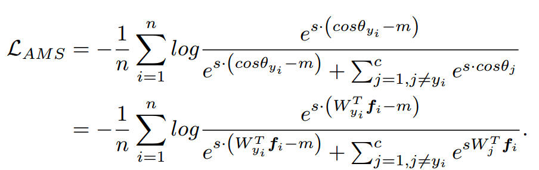

# AmSoftmax

* 主要创新点
  * 将角度边界（更加简洁的角度边界【原始为cos(theta-m)】，梯度求解更加的方便）引入了softmax函数，增加类间距，减少类内距。

* 损失函数如下：
  
  * AmSoftmax与softmax函数相比，将 Wx 替换为 s*(cos(theta)-m)
  * cos(theta) - m 表示类别间至少有m的距离
  * 将分子exp项归一化，可以看出损失函数值相较softmax的形式会增加，模型需要提高cos(theta)值
    才能达到变化前的值。
    
  * s增加收敛速度