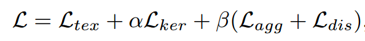

# 文字检测

## 问题与挑战
* 长宽比例变化较大
* 文本框的形状较多：水平，垂直，倾斜，弯曲

## 主要解决方案
主要解决方案包含两种，分别是基于回归方法的文本检测，以及基于分割方法的文本检测

### 基于回归的文本检测

#### TextBoxes
* backbone 
  * VGG
* neck
  * 多层级预测
* head
* loss
  * 坐标表示方式
  * 损失函数
* anchor
    * 三种不同的scale和ratio，组合生成9种不同的anchor box，用于获取图片中的候选目标框

    
#### TextBoxes++
* backbone
* neck
* head
* loss
* update
    * 引入了任意四边形的表示方法
        * (left\_top,right\_top,right\_down,left\_down)
        * (left\_top,right\_down,angle)
        *  (left\_top,right\_top,height)

#### EAST
* backbone
	* PVANet
* neck
	* FPN
        * 用最后一层的特征做分类与回归任务
* prediction
	* (top,down,left,right,angle,score)
	* (x1,y1,x2,y2,x3,y3,x4,y4)
    * 与yolo系列（多层级预测）不同的是，这里仅仅使用最后一层进行参数回归分类
* loss
	* 文本得分损失，论文中使用cross entropy，一般会用dice loss替代
	*  几何损失，每一个像素与边界的smooth l1损失
	
* nms
	* Locality-Aware NMS(局部感知NMS)
		* 是一种合并几何体的方法（假设临近的几何体是高度相关的)
          * 以一定的顺序遍历每一个几何体p，并判断每个几何体与其他几何体的重叠情况
            * 假如重叠面积超过指定阈值，则按照score对几何体的坐标加权平均
            * 重叠面积达不到指定阈值，则将p加到后处理集合S中，并开始遍历q
          * 用标准的NMS方法处理集合S
		*  合并逻辑：假如两个box的交并比超过指定阈值，则将box score作为权重因子对坐标加权平均
		
* 标签生成
	* 沿边缘向内缩减两端点距离的0.3r

### 基于分割的文本检测

#### PSENet
* 主要创新
  * 基于语义分割方法进行文字检测任务，模型拟合多个不同的text kernel，并提出了scale expansion algorithm聚合text kernel，得到文本实例。
  * 提出了渐进式尺度扩展算法
* backbone
  * resnet
* neck
  * FPN
    * 与DBNet不同的是，这里会再次利用每个层级的feature map融合的结果，并预测k个分支，分别预测不同的kernel
* head
* loss
    * dice loss
        * 计算每一个核的损失
    
* 渐进式尺度扩展
  * 从最小的kernel开始，使用dfs算法，合并周围的较大的kernel区域
* 标签制作：见DBNet标签制作
* 其他
 * 个人感觉PSENet与PANNet速度差不多，主要是PANNet采用了层数更少的backbone,为了弥补层数的不足，PANet引入了FPEM与FFM
 * PANet与PSENet后处理的时间复杂度总体一致，都需要遍历所有可能的text pixels

#### PANNet
* 主要创新
  * 像素聚合
* backbone
  * resnet18
* neck
  * FPEM
    * FPN的增强版
      * partA:侧向连接结构，连接具有相同尺寸的前馈feature map与采样feature map好处在于融合位置信息与语义信息
      * partB:侧向连接结构，连接具有相同尺寸的上采样feature map与下采样feature map
      
  * FFM
    * 对FPEM做element-wise addition操作
* head
* loss
  
    
    * L_tex
        * 文本损失，dice loss
      
    * L_ker
        * 核损失，dice loss
      
    * L_agg
        * 文本(similarity vector)与kernel(similarity vector)的距离损失
            
    * L_dis
      * 不同kernel的similarity vector的距离损失
        
    
* PA (像素聚合)
    * 确认kernel，每个kernel就是一个文本区域（相比文本区域会小一些）
    * 当kernel(当前文本框所表示的kernel的平均)与text pixel的相似度向量小于d时，则将该text pixel并入当前kernel，（每个kernel上下左右四个方向）
    * 每个text一个kernel，相比与PSENet，kernel数目会更少

#### DBNet
* 主要创新点
  * 提出了可微分二值化(DB)模块，通过优化DB模块，模型可以自适应地设置二值化阈值，进而简化后处理过程，可以提高模型的检测效果。
    * 简化后处理：较为耗时的后处理方法是对每个文本像素进行聚合，求得连通域，得到文本区域（dfs算法），较为耗时，而DBNet直接对
      probability map做二值化，直接计算文本区域的边界。
      
* backbone
  * resnet18
  * deformable convolution
    * 传统卷积几何结构固定，对不规则物体的模拟存在限制
    * 引入偏移量的概念，学习input feature map每个位置的偏移量，偏移后的位置可能是小数，因此用双线性插值的方法获取偏移后的值，随后按照对应
        元素相乘相加的计算方式获得输出feature map
    * 叙述
        * 传统卷积几何结构固定，在模拟拥有复杂形状的物体是存在一定的限制，可变形卷积通过引入位置偏移量的概念，学习input feature map每个
            位置的偏移量，并通过双线性插值的方法得到插值后的feature map,最后按照传统卷积计算的方式计算即可，deformable roi pooling也是如此
* neck
  * FPN
    * 侧向连接结构，合并top-down(feature map上采样的过程)与bottom-up(backbone的feed-forword的过程)相同尺寸的feature map
    * 好处在于可以融合浅层位置信息与深层的语义信息
* head
  * threshold map
    * 文本阈值
  * text map
    * 像素文本概率
    * 将FPN的结果上采样到原始图像大小，预测text prob与thres
  * DBHead
    * threshold map与text map作为输入，在DBHead的作用下（sigmid函数），输出是文本的概率
    
    
* loss
    *  DBLoss
       * 将文本阈值T,文本概率P作为sigmoid函数的输入，构建Differentiable Binarization模块
         * 边界阈值较高，在DB模块的作用下，会强行拉高边界文本阈值的预测概率值，进而使得边界更加的明显【抛弃以dfs为核心的复杂后处理，直接计算二值化图的轮廓。
       * DB的输出与标签计算交叉熵损失，常用dice loss替代
    *  L1 Loss(阈值损失): 
       * 阈值模块的预测结果标签计算L1损失
       * 标签的取值范围：[0.3,0.7] ，取值越大的像素越靠近文字框的边界，边界阈值越高，通过DB模块后，
         就会拉高该像素是文本的概率，从而增加边界的区分性。
    *  cross entropy(像素分类损失，常用dice loss替代) 
    * dice loss
        * 解决了正负样本不均匀的问题（基于像素的分类问题正负样本比例差异较大），小目标下，容易产生剧烈的震荡，
          原因在于小目标样本的分母相对较小，重叠面积稍微的偏移，都会引起loss剧烈的变化
          
        * dice loss解决样本不均匀问题？
            * F1可看作是dice coefficient的一种特例，相交的区域是TP，其他两个区域分别是FN和FP，（F1值可以在正负样本不均匀的情况下度量模型的性能）
          
* 标签制作
    * Vatti clipping algorithm
        * 通俗地来说，就是等比例的缩放多边形，缩放的长度是周长与面积的函数
        * 该算法可获得每个标注文本框的迷你框，缩小后的文本区域作为模型 *text map* 的监督标签（缩小预测区域，可以有效避免大框部分重叠导致两个框粘连的问题）
        * 基于缩小后的文本框，生成 *threshold map* 的监督标签,生成规则：缩小后的边界区域阈值为0.7，其他位置的阈值与距离边界的长度程负相关（一次线性函数，最小是0.3）
    
* 拓展
    * 后处理
        * 设置静态阈值或者使用动态阈值获得二值化输出结果
        * cv2.findContours检测二值化结果的轮廓，轮廓可以是任意多个点
        * cv2.minAreaRect获取任意多边形的最小外接矩形，对于多边形用cv2.approxPolyDP提取多边形曲线
        * 噪音过滤：通过设置四边形的最小边长，过滤部分错误召回的结果
    
    * 模型过切割问题
        * 假如标注数据中，存在很多过切割的样本，那么训练后的模型对间隔也十分敏感，若要降低过切割问题，可以从标注样本入手
    
* MaskTextSpotter
  * 基于Mask RCNN,将输出当替换为字符实例分割图与文本实例分割图
    
* MASTER的变种【平安】
  * 最初是是为了文字识别方法方法中attention drift问题以及s2s方法无法并行化的问题提出，crnn+transformer结构