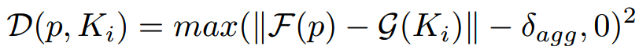
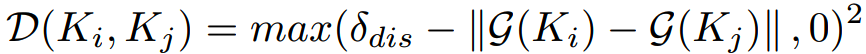

# 文字检测

## 问题与挑战
* 长宽比例变化较大
* 文本框的形状较多：水平，垂直，倾斜，弯曲

## 主要解决方案
主要解决方案包含两种，分别是基于回归方法的文本检测，以及基于分割方法的文本检测

### 基于回归的文本检测

#### TextBoxes
* backbone 
  * VGG
* neck
  * 多层级预测
* head
* loss
  * 坐标表示方式
  * 损失函数
* anchor
    * 三种不同的scale和ratio，组合生成9种不同的anchor box，用于获取图片中的候选目标框

    
#### TextBoxes++
* backbone
* neck
* head
* loss
* update
    * 引入了任意四边形的表示方法
        * (left\_top,right\_top,right\_down,left\_down)
        * (left\_top,right\_down,angle)
        *  (left\_top,right\_top,height)

#### EAST
* backbone
	* PVANet
* neck
	* FPN
* prediction
	* (top,down,left,right,angle,score)
	* (x1,y1,x2,y2,x3,y3,x4,y4)
    * 与yolo系列（多层级预测）不同的是，这里仅仅使用最后一层进行参数回归分类
* loss
	* 文本得分损失，论文中使用cross entropy，一般会用dice loss替代
	*  几何损失，每一个像素与边界的smooth l1损失
	
* nms
	* Locality-Aware NMS
		* 是一种合并几何体的方法（假设临近的几何体是高度相关的)
		*  合并逻辑：假如两个box的交并比超过指定阈值，则将box score作为权重因子对坐标加权平均
		
* 标签生成
	* 沿边缘向内缩减两端点距离的0.3r

### 基于分割的文本检测

#### PSENet
* 主要创新
  * 基于语义分割方法进行文字检测任务，模型拟合多个不同的text kernel，并提出了scale expansion algorithm聚合text kernel，得到文本实例。
* backbone
  * resnet
* neck
  * FPN
* head
* loss
    * dice loss
        * 计算每一个核的损失
    
* 标签制作：见DBNet标签制作

#### PANNet
* 主要创新
  * 像素聚合
* backbone
  * resnet18
* neck
  * FPEM
    * FPN的增强版
      * 上采样，与浅层同尺寸的feature map相加
      * 下采样，与上采样同尺寸的feature map相加
      
  * FFM
    * 对FPEM做element-wise addition操作
* head
* loss
    * 聚合损失
      * pixel的similarity vector与kernel的similarity vector之间的距离要尽可能的小，见下图:
        
        
        
    * 核损失
      * 不同核之间的similarity vector需要大于某个阈值，见下图
        
        
    * 文本损失
      * 每个像素是否属于文本的损失，用dice loss计算
    
    
* PA (像素聚合)
    * 确认kernel，每个kernel就是一个文本区域
    * 当kernel与text pixel的相似度向量小于d时，则将该text pixel并入当前kernel，（每个kernel上下左右四个方向）

#### DBNet
* 主要创新点
  * 提出了可微分二值化模块，该模块将文本阈值引入到模型中，使得每个像素的文本阈值动态可调节
* backbone
  * resnet18
  * deformable convolution
* neck
  * FPN
* head
  * threshold map
    * 文本阈值
  * text map
    * 像素文本概率
  * DBHead
    * threshold map与text map作为输入，在DBHead的作用下（sigmid函数），输出是文本的概率
* loss
    *  DBLoss
       * 将文本阈值T,文本概率P作为sigmoid函数的输入，构建Differentiable Binarization模块
       * DB的输出与标签计算交叉熵损失，常用dice loss替代
    *  L1 Loss(阈值损失): 
       * 阈值模块的预测结果标签计算L1损失
       * 标签的取值范围：[0.3,0.7] ，取值越大的像素越靠近文字框的边界，边界阈值越高，通过DB模块后，
         就会拉高该像素是文本的概率，从而增加边界的区分性。
    *  cross entropy(像素分类损失，常用dice loss替代) 
    * dice loss
        * 解决了正负样本不均匀的问题（基于像素的分类问题正负样本比例差异较大），小目标下，容易产生剧烈的震荡，
          原因在于小目标样本的分母相对较小，重叠面积稍微的偏移，都会引起loss剧烈的变化
          
        * dice loss解决样本不均匀问题？
            * F1可看作是dice coefficient的一种特例，相交的区域是TP，其他两个区域分别是FN和FP，（F1值可以在正负样本不均匀的情况下度量模型的性能）
          
* 标签制作
    * Vatti clipping algorithm
        * 通俗地来说，就是等比例的缩放多边形，缩放的长度是周长与面积的函数
        * 该算法可获得每个标注文本框的迷你框，缩小后的文本区域作为模型 *text map* 的监督标签（缩小预测区域，可以有效避免大框部分重叠导致两个框粘连的问题）
        * 基于缩小后的文本框，生成 *threshold map* 的监督标签,生成规则：缩小后的边界区域阈值为0.7，其他位置的阈值与距离边界的长度程负相关（一次线性函数，最小是0.3）
    
* 拓展
    * 后处理
        * 设置静态阈值或者使用动态阈值获得二值化输出结果
        * cv2.findContours检测二值化结果的轮廓，轮廓可以是任意多个点
        * cv2.minAreaRect获取任意多边形的最小外接矩形，对于多边形用cv2.approxPolyDP提取多边形曲线
        * 噪音过滤：通过设置四边形的最小边长，过滤部分错误召回的结果
    
    * 模型过切割问题
        * 假如标注数据中，存在很多过切割的样本，那么训练后的模型对间隔也十分敏感，若要降低过切割问题，可以从标注样本入手