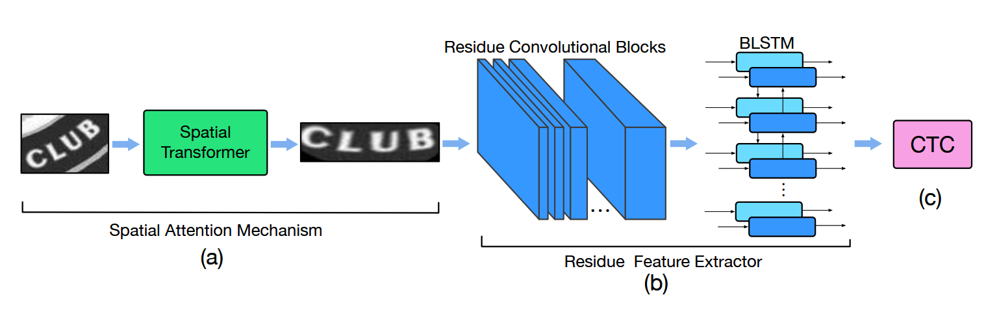

# STAR(SpaTial Attention Residual network,BAIDU)

* 主要创新点
 * 使用spatial transformer【STN】消除自然场景下文本扭曲的带来的识别问题,同时融合卷积残差模块强化特征抽取【防止梯度消失与特征退化】

* 模型结构
  
* spatial transformer network
  * Localisation Network
    * 学习仿射变换矩阵（无监督）
    * CNN+FC回归K个基准点，即2K维向量得到，对于仿射变换，回归shape为2x3的仿射变换矩阵即可
    * 论文RARE中回归K个点做样条变换，解决文本扭曲的问题
      
    
  * Sampler
    * 在仿射变换矩阵的作用下，确定变换后的每一个点
  * Interpolator
    * 变换后的点可能在非整数位置，采用双线性插值的方法获取新的整数位的点
    
* Residual Feature Extractor
    * 特征抽取：[W,H,3] --> [W',H',C]
    * 特征重组：[W',H',C]--> [W',H' * C]
    * LSTM：序列编码
    * CTC: 计算序列损失