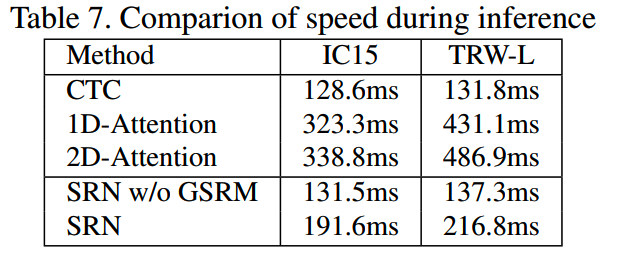
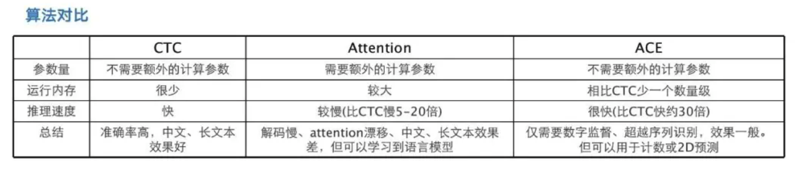

# 文字识别
## 主要问题
* 形近字识别问题
    * 利用单字识别模型解决
    * 利用语言模型后处理优化
  
* 弯曲文本或者不规则文本的识别问题
  
## 文字识别
* crnn+ctc行识别
  * 推理速度快，对中长文本的鲁棒性更高
  * ctc方法容易产生尖峰分布的问题
  * 对语言模型的依赖性更少(CTCLoss通过最大似然估计得到，最大似然估计的前提条件是独立同分布，因此CTC算法对语言模型的依赖性不强)，
    中文的字符个数更多，s2s依赖数据量，从数据量上来说，ctc模型显得更加友好。
  * 不能解决弯曲文本问题，需要STN辅助
    * STN算法的目的是，纠正扭曲图片
      * localization network，回归特征变换参数
      * grid generator,利用特征变换参数，对feature map进行空间变换，获得变换后的feature map在原始feature map上的位置
      * sampler,双线性插值，解决变换后位置处于非整数点的问题
  
* attention行识别
  * 解码计算过程
    * 当前解码器的state，与编码器的输出计算attention权重，获取当前时刻的输入特征，将前一时刻的输出作为另外一个输入特征。
  * 是一种隐式的语言模型，因此需要更大的数据量训练模型
  * 对于不认识的字符，模型的结果可能对产生较大的波动（s2s模型会积累误差）
  * 解码速度慢，长文本容易积累误差
  
* 扭曲文本行的识别
  * STN方法
  
* 其他
  * transformer方法，transformer作为解码器，替换lstm
  
* yolov5/dbnet + resnet(amsoftmax) 单字分类
    * amsoftmax
  
* 多种识别方法的速度
  
  
  
  

## 后处理
### 形近字获取

* 取crnn模型的分类层作为形近字的embedding
  * 为什么分类层的权重可以作为聚类的向量？
    * center loss、circle loss等论文中提出的重要思想：分类层的权重w可以视作是类别中心，优化的过程等价于最小化输入emebding与权重w的cosine距离（softmax）,其他损失函数类似
* kmeans聚类
* 训练过程随机动态替换

### 形近字的优化

1、利用center loss优化，优化前需要先处理数据，

## 文字识别相关论文
  * [SRAR](./paper_thinking/STAR.md)：ctc+attention(并非s2s方法)方法，解决扭曲文本识别问题
  * [RARE](./paper_thinking/RARE.md): s2s方法，解决扭曲文本问题，或不规则文本问题

## 文字识别数据集
 * [CCPD(Chinese City Parking Dataset)](https://github.com/detectRecog/CCPD)

## 文字生成

* [Color_OCR_image_generator](https://github.com/zcswdt/Color_OCR_image_generator)
* [text renderer](https://github.com/oh-my-ocr/text_renderer)
* [style text](https://github.com/PaddlePaddle/PaddleOCR/tree/release/2.2/StyleText)