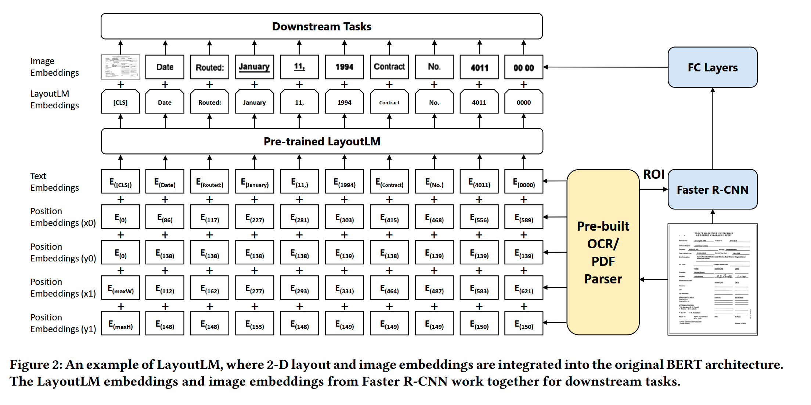
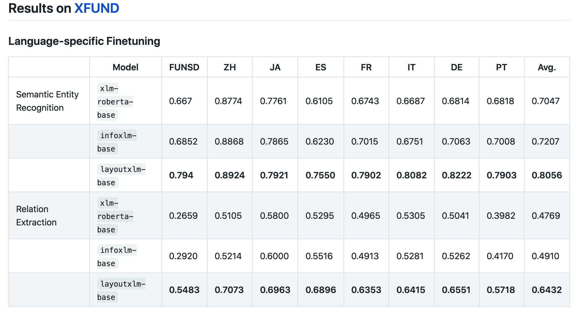

# 版面分析

## 简介
* LayoutLM系列是一种多模态的版面分析工作，从下游命名实体抽取任务来看，相比基于BERT的NER任务，LayoutLM 在输入端会额外编码图像上下文信息，
  图像文本位置信息，从预训练语言模型的角度，LayoutLM提出了Text-Image Alignment任务，Text-Image Matching任务。

## LayoutLM

* Pretrain
  * 输入
    * text embedding
    * position x0 embedding
    * position y0 embedding
    * position x1 embedding
    * position y1 embedding（相当于text position embedding）
    * 每个位置输入一个英文单词，以及该单词在图片上的位置编码（分别用矩形左上角的点【x0,y0】，右下角的点【x1,y1】进行位置编码）
  * 模型结构
    * 模型结构如下：
            

  * task
    * masked visual-language model
      * 随机mask一些tokens,但保留位置信息，模型预测被mask的token
    * multi-label document classfication
      * 文档图片的多标签分类任务
    
* Finetune
  * dataset
    * FUNSD(199张图片，标注了位置，文字，以及实体类型)
  
  * 下游任务
    * 命名实体识别
    * 输入
      * image embedding（注意：图片信息只在finetune阶段引入）
        * 图片中每个box的image embedding(RoI)
      * bert encode embedding
  
        
## LayoutLMV2
* 特点
  * 相比LayoutLM,LayoutLMv2在预训练阶段引入图片信息，可以让transformer结构更加充分学习文本和图像的跨模态信息
      
* Pretrain
    
  * 输入
    * visual embedding (图片分块后的feature map，新) 
    * text embedding 
    * 2D position embedding（图片及文本框的位置编码，用四个x维的向量叠加）
      * 图片中的位置转one hot再线性变换成指定维度
    * 1D position embedding(类似于bert的位置编码)
    * segment embedding
  
 * 模型结构
    * 模型结构如下：
          
  * task
      * 文本图片匹配是否匹配的任务，类似于bert中两条文本是否是上下句
      * text-image alignment，预测文本（单词）是否被覆盖
      * masked visual-languange model,预测被mask掉的文字
  
  * visual embedding不止4个，由feature map的尺寸决定（W*H个），图片分类finetune用[CLS]

 
## [LayoutXLM](https://github.com/microsoft/unilm/tree/master/layoutxlm)
* 特点
  * 多模态**多语言**的预训练模型

* Pretrain
    
  * model
    * XLM模型（提出并验证词表的分割方法对下游任务的影响）
    
  * 输入（与LayoutLMv2一致）
    * segment embedding(区分图片和文本,bert中用于区分上下句) 
    * 1D position embedding(确定文字位置编码以及图片区域位置)
    * 2D position embedding(图片位置【分割后的文档位置】以及文本框位置)
    * visual/text token embedding(图片以及文本编码)
        ```python
       def _cal_spatial_position_embeddings(self, bbox):
            try:
                left_position_embeddings = self.x_position_embeddings(bbox[:, :, 0])
                upper_position_embeddings = self.y_position_embeddings(bbox[:, :, 1])
                right_position_embeddings = self.x_position_embeddings(bbox[:, :, 2])
                lower_position_embeddings = self.y_position_embeddings(bbox[:, :, 3])
            except IndexError as e:
                raise IndexError("The :obj:`bbox`coordinate values should be within 0-1000 range.") from e
    
            h_position_embeddings = self.h_position_embeddings(bbox[:, :, 3] - bbox[:, :, 1])
            w_position_embeddings = self.w_position_embeddings(bbox[:, :, 2] - bbox[:, :, 0])
    
            spatial_position_embeddings = torch.cat(
                [
                    left_position_embeddings,
                    upper_position_embeddings,
                    right_position_embeddings,
                    lower_position_embeddings,
                    h_position_embeddings,
                    w_position_embeddings,
                ],
                dim=-1,
            )
            return spatial_position_embeddings
        # 疑惑：（x1,y1,x2,y2,w,h），为什么要引入w,h?单纯的增加特征？
        ```
      
  * task
      * 文本图片匹配是否匹配的任务，类似于bert中两条文本是否是上下句
      * text-image alignment，预测文本（单词）是否被覆盖
      * masked visual-languange model,预测被mask掉的文字
  
* Finetune
  * dataset
    * XFUN(7种语言，1393张数据)

  * 下游任务
      * 语义实体识别
        * BIO标签
        * 检测识别获取文本框的位置，相比其他pipeline方法（检测+识别+NER），额外利用了文本位置信息,当前方法并不是一个end2end的方法。
        
      * 关系抽取
        * 获取(head,tail)关系对，做分类任务
  * 试验结果
    
    * 从中文试验结果来看，增加文本位置信息，可以小幅度提高测试集的准确率
      
      
* 注
  * XLM：英文单词的切割方式会影响预训练语言模型在finetune时的精度。
  * 暂时不可用，没有开源预训练语言模型，2021.07.07,LayoutLMV2可用
  * 数据通过解析PDF得到,预训练数据30 million(XFUN,benchmark中包含1393张表单数据，共七种语言，每种语言199张全文标注)