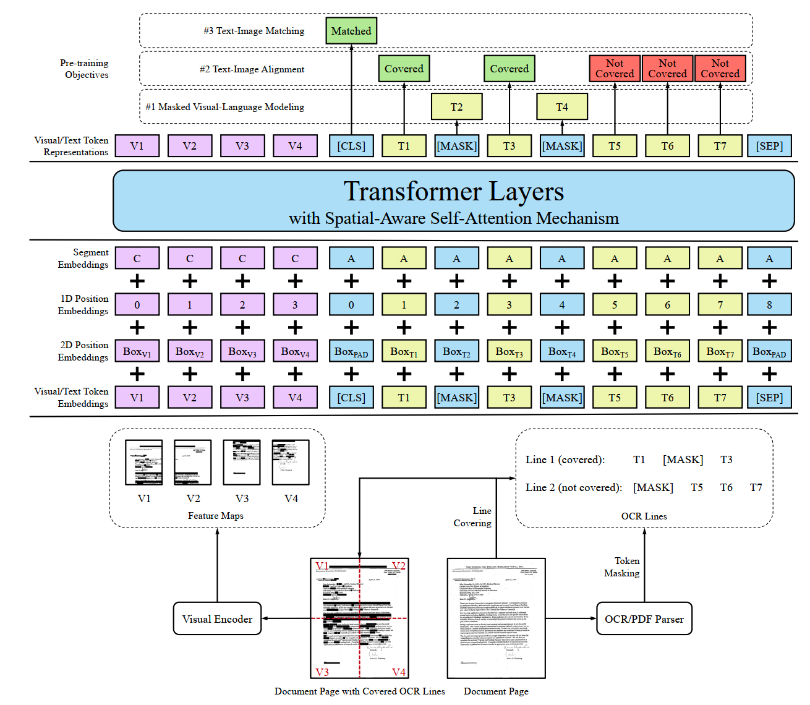

# 版面分析

## 证件识别
* 数据问题
  * 文字识别错误主要是形近字错误
  * 少数生僻字输入法找不到，无法标注，机器也无法识别，识别为该字的形近字
  * 身份证号码最后一位丢失
  * 数字识别错误(6,4,3,8)
  * 图片旋转识别问题
  * 身份证背景干扰容易误识别出一些标点符号
  * 姓名中的"汉"会被认为是民族
  * 有效日期中的标点符号容易错误识别
  * 日期识别易错
  * 维吾尔族人名的"·"识别成"-"
  * 身份证图片只有半张，主要是左半部分缺失，关键字段名缺失，正则方法无法有效提取
  * 身份证号码部分数组识别成数字或者字母
  * 身份证背景栏会引发特定的错误，比如将背景识别成"人"，"入"，"一"
  

* 证件检测
  * yolov5
* 文字检测
  * DBNet
    * 单字符容易漏识别
* 文字识别
  * CRNN
    * 号码类最后一位容易漏识别
* 信息抽取
    * 正则
      * 抽取目标：身份证号码、有效期限、性别、性别...
      * 存在的问题：识别的结果有噪音，无法完全用正则的方法匹配出来，尝试使用NER方法结合正则处理

    * NER
    
## LayoutLM

* Pretrain
  * dataset
    * more than 6 million documents, with more than 11 million scanned document images.
    
  * 输入
    * text embedding
    * position x0 embedding
    * position y0 embedding
    * position x1 embedding
    * position y1 embedding（相当于text position embedding）
    * 每个位置输入一个英文单词，以及该单词在图片上的位置编码（分别用矩形左上角的点【x0,y0】，右下角的点【x1,y1】进行位置编码）
  * 模型结构
    * 模型结构如下：
            

  * task
    * masked visual-language model
      * 随机mask一些tokens,但保留位置信息，模型预测被mask的token
    * multi-label document classfication
      * 文档图片的多标签分类任务
    
* Finetune
  * dataset
    * FUNSD(199张图片，标注了位置，文字，以及实体类型)
  
  * 下游任务
    * 命名实体识别
    * 输入
      * image embedding（注意：图片信息只在finetune阶段引入）
        * 图片中每个box的image embedding(RoI)
      * bert encode embedding
  
        
## LayoutLMV2
* 特点
  * 相比LayoutLM,LayoutLMv2在预训练阶段引入图片信息，可以让transformer结构更加充分学习文本和图像的跨模态信息
      
* Pretrain
  * dataset
    
  * 输入
    * visual embedding (图片分块后的feature map，新) 
    * text embedding 
    * 2D position embedding（图片及文本框的位置编码，新）
    * 1D position embedding(类似于bert的位置编码)
    * segment embedding
  
 * 模型结构
    * 模型结构如下：
          
  * task
      * 文本图片匹配是否匹配的任务，类似于bert中两条文本是否是上下句
      * text-image alignment，预测文本（单词）是否被覆盖
      * masked visual-languange model,预测被mask掉的文字
  

 
## LayoutXLM
* 特点
  * 多模态**多语言**的预训练模型

* Pretrain
  * dataset
    
  * model
    * XLM模型（提出并验证词表的分割方法对下游任务的影响）
    
  * 输入（与LayoutLMv2一致）
    * segment embedding(区分图片和文本,bert中用于区分上下句) 
    * 1D position embedding(确定文字位置编码以及图片区域位置(左上、右上、左下、右下))
    * 2D position embedding(图片位置【分割后的文档位置】以及文本框位置)
    * visual/text token embedding(图片以及文本编码)
      
  * task
      * 文本图片匹配是否匹配的任务，类似于bert中两条文本是否是上下句
      * text-image alignment，预测文本（单词）是否被覆盖
      * masked visual-languange model,预测被mask掉的文字
  
* Finetune
  * dataset

  * 下游任务
      * 语义实体识别
        * BIO标签
      * 关系抽取
        * 获取(head,tail)关系对，做分类任务
      
* 注
  * XLM：英文单词的切割方式会影响预训练语言模型在finetune时的精度。
  * 暂时不可用，没有开源预训练语言模型，2021.07.07,LayoutLMV2可用
  * 数据通过解析PDF得到,预训练数据30 million(XFUN,benchmark中包含1393张表单数据，共七种语言，每种语言199张全文标注)

  
## 其他
* Levenshtein中的opcodes方法可以获取strA到strB每个字符的变换类型['insert','replace','delete','add']